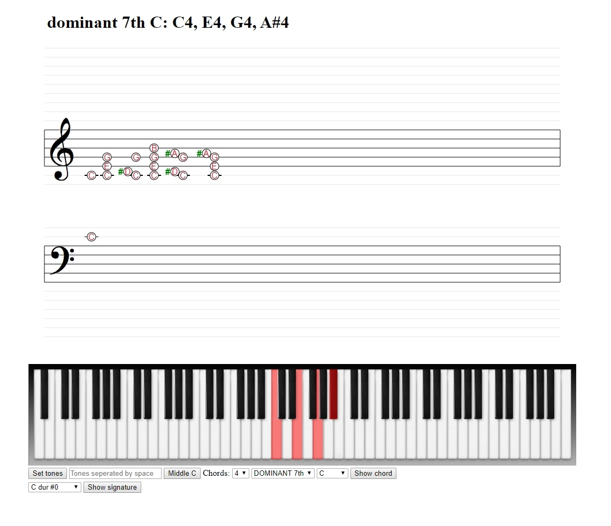

# KeyboardKeys

## Info
* this website is for teaching purporse with virtual keyboard/piano
* created mainly for me, because I want to learn, how to play the piano
## Features
* 88 keys keyboard, with key mapping to notes section
* treble and bass notes section
* click to note section show the correct keyboard key
* set tones - `C4 C5` - custom tones will be showed in notes section and on the keyboard
* middle C - main key, it will be shown in treble and bass section
* chords - start octave, chord type and chord main tone will be displayed in notes section and correct keys on the keyboard
* signature - number of # and b in the name, signature keys will be shown on the keyboard
* game section - guess right notes according to the notes
## Usage
* you need only nodejs to run this webpage
* `npm install`
* in seperate console window: `npm run watch`
* in seperate console window: `node server.js`
* in browser navigate to webpage: `http://localhost:8004/`
## Licence
* free to use, any part of this source code can be used in your own projects
